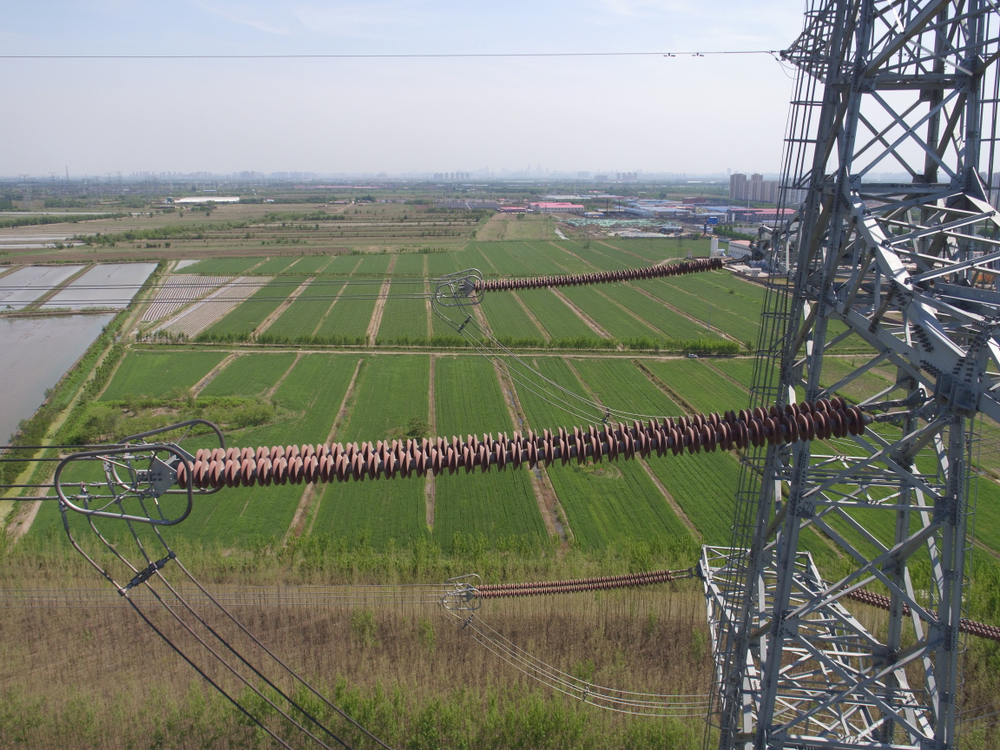
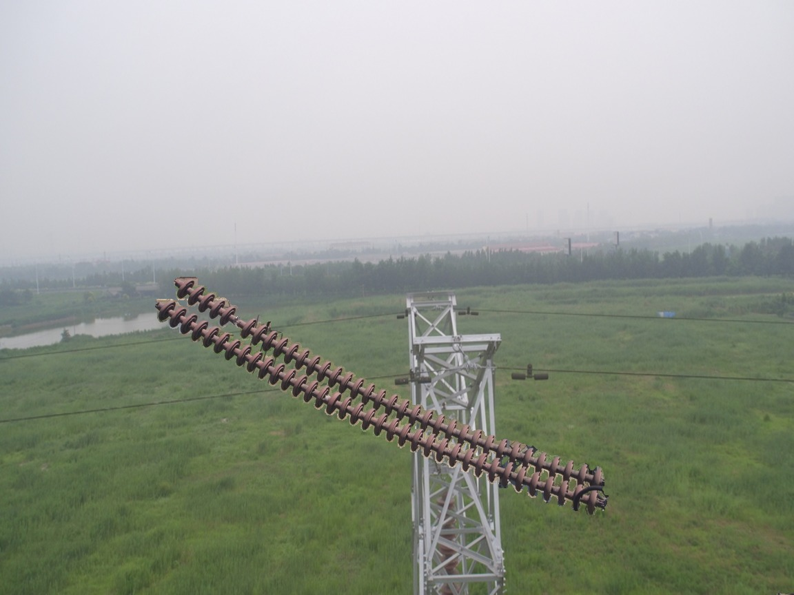

Building a machine vision inference application using ML.NET and TensorFlow for classifying images. This program imports an already-trained binary image classification model (trained using Keras and Tensorflow with Python in another project) and uses
that classification model to identify any of a set of images of powerline insulators as either "broken" or "not broken". More details and images below: 

The net loads up an image of a powerline insulator in the countryside, and classifies the image as "broken" or "not broken". The "broken" images are artifially generated, but the model could easily be tuned to do more useful work (such as detecting defects on the label of a cereal box, for example). 

A normal ("not broken") insulator image, used in training:

A broken insulator image, also used in training:

TO RUN THIS PROJECT
Simply download the folder marked "MachineVisionInference", save it to your desktop (or other folder), then open the project or solution file with Visual Studio. The following libraries will need to be downloaded using NuGet: Microsoft.ML, Microsoft.ML.Tensorflow, Microsoft.ML.ImageAnalytics. To run the model, simply change the file paths to the photos and the model to the paths on your own computer, and hit run.
